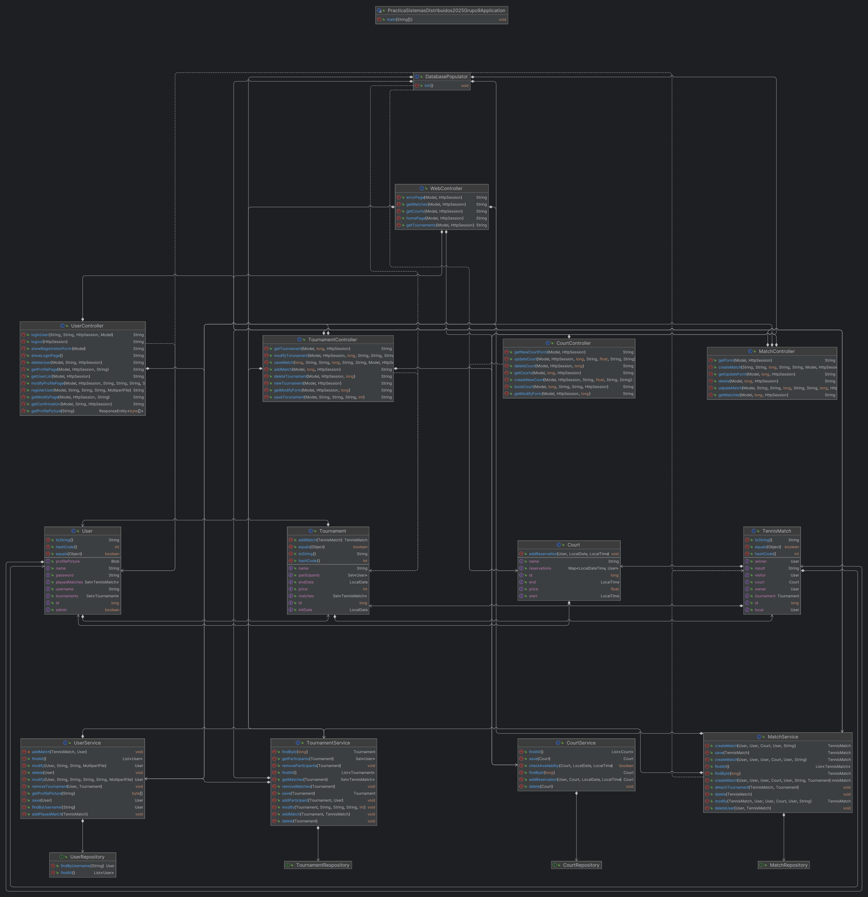
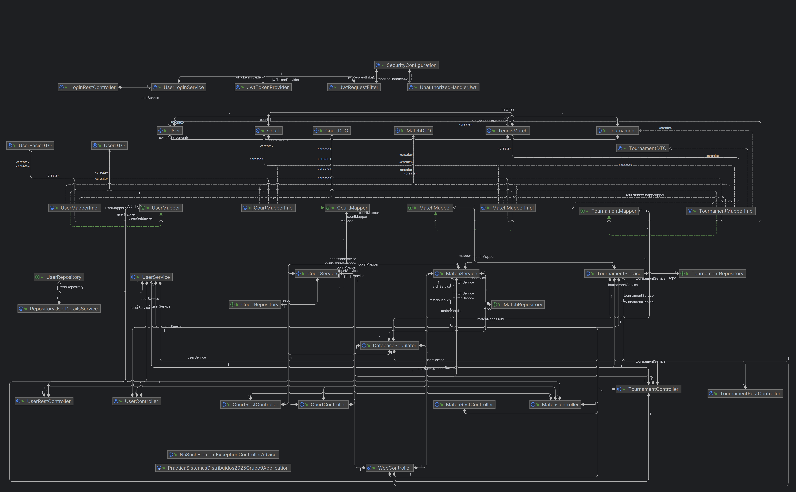

# Club de Tenis
## Permisos de los usuarios
* Visitante
  * Ver los partidos y torneos jugados por cualquier usuario
  * Ver los perfiles de otros usuarios
  * Ver los torenos
* Usuario registrado
  * Ver los partidos y torneos jugados por cualquier usuario
  * Ver los perfiles de otros usuarios
  * Crear y modificar los partidos propios
  * Reservar una pista
* Administrador
  * Ver los partidos y torneos jugados por cualquier usuario
  * Crear y modificar torneos
  * Crear y modificar partidos de cualquier usuario
  * Crear y modificar pistas
  * Modificar usuarios

## Capturas de pantalla

  * Página principal:
 

Podemos ver la barra de navegación la cual estará presente en el resto de páginas. En esta tenemos los siguientes textos que nos redirigen a las páginas relacionadas con cada uno y dos botones, “Entrar” el cual nos lleva a la página de login y “Registrarse” que nos lleva a la pagina de registro.
Debajo de esta se encuentra la sección de “Últimos Partidos” y “Lista de Torneos” en las que se ven los partidos jugados y los torneos respectivamente.

  * Página de registro:
 

Esta página sirve para que los usuarios se registren, es requerido que el usuario introduzca todos los campos a excepción de “Foto de Perfil” ya que este es opcional.

  * Pagina de Inicio de sesión/Login
 

En esta página tenemos los campos para rellenar “Username” y “Contraseña” y el botón Enviar para hacer el login.

  * Pagina de Perfil de usuario:
 

En la barra de navegación al iniciar sesión se cambiarán los botones por “@username” y “Salir” los cuales te llevarán a la página del perfil del usuario y el se salir te cerrarán la sesión y te llevara a la página de login.
Además, en esta se encuentra la foto del usuario, a su derecha su username, debajo de estos el botón de modificar, que solo se mostrará si nuestra sesión es la del perfil o un administrador y por último el nombre y los partidos que este ha jugado.

  * Página de Partidos:
 

En esta pagina se nos muestran los partidos jugados y el botón “Nuevo Partido” para crear un nuevo partido el cual solo veremos si hemos iniciado sesión.
 
  * Página de Detalles del Partido:
 

En esta página está el usuario local y visitante, el resultado y el ganador de este junto con los botones de “Modificar” y “Eliminar” los cuales solo se verán si eres el propietario del partido o un administrador.

  * Página de Modificar Partido/Crear Partido:
 

La página de modificación contiene los campos necesarios para crear el partido.
Esta página es casi idéntica a la de creación, las diferencias son que en los campos a rellenar estarían vacíos excepto el de Pista.

  * Página de Torneos:
 

En esta página se nos muestran todos los torneos con su nombre, fechas, precio, teléfono para inscribirse(el del club de tenis), y el botón de ver detalles. El resto de botones(Nuevo Torneo, Modificar y Eliminar) solo se verán si somos un administrador.

  * Pagina de Detalles del Torneo:
 

En esta pagina se observa el nombre del torneo, las fechas, el precio, los participantes y los partidos jugados del torneo. Si somos el administrador veremos también el botón de “Añadir Partido”.
 
  * Página de Creación/Modificación de Torneo:
 

En esta página tenemos el formulario para la creación o modificación de los torneos con los campos necesarios para crear este.

  * Página de Pistas:
 

En esta página veremos el nombre, horario, precio y el botón de reservar de estas si somos un usuario normal o un invitado y veremos de manera adicional los botones de crear pista, modificar y eliminar en caso de que seamos administrador.
 
  * Página de Reservar pista:
 

En esta pagina vemos el nombre de la pista, su precio, y dos campos para la fecha y la hora de la reserva.

  * Página de Creación/Modificación de Pista:
 

En esta página tenemos los campos necesarios para crear o modificar una pista cambiará de “Crear Pista” a “Modificar Pista” en caso de estar modificando una pista.
 
  * Página de Lista de Usuarios:
 

Está pagina será solo visible para los administradores y es accesible desde la barra de navegación desde el texto “Usuarios”, en esta el administrador puede ver los perfiles de los usuarios y eliminarlos si fuese necesario.

  * Página de Error:
 

Esta página será la que veremos cuando vayamos a una página inexistente u otros errores ocasionados en alguno de estos se cambiará el texto para indicar el error. Ej. Al intentar acceder a “/tournament/new” sin ser administrador nos dará el texto “Un usuario sin privilegios no puede crear un torneo”.
## Diagrama de navegación
 * Las flechas verdes representan las páginas a las que pueden acceder todos los usuarios.
 * Las flechas rojas representan las páginas a las que solo pueden acceder los usuarios con sesión iniciada.
 * Las flechas amarillas representan las páginas a las que solo pueden acceder los usuarios que son administradores.
 * A la página de error se puede acceder desde cualquier página.
 
## Diagrama de entidades

## Diagrama de Clases Fase I

## Diagrama de Clases Fase II

## Instrucciones de Ejecución
1. Tener instalado Docker 
2. Tener instalado Maven
3. Ejecutar el siguiente comando para iniciar la base de datos o el script `runMySQL.ps1`
```shell
docker run --rm -e MYSQL_ROOT_PASSWORD=admin  -e MYSQL_DATABASE=clubtenis -p 3306:3306 -d mysql:8.0.22
```
4. Ejecutar el siguiente comando para iniciar el servidor spring
```shell
mvn spring-boot:run
```
5. Accede a la aplicación a traves de: https://localhost:8443

## Docker 
Para crear la imamgen Docker se puede hacer de varias formas:
1. Ejecutando un comando maven para construir la imagen desde la consola:
   ````shell
   mvn spring-boot:build-image -Dspring-boot.build-image.imageName=rodrilb/clubtenis:1.0.0
   ````
2. Con el DockerFile proporcionado:
   ````shell
   docker build -t rodrilb/clubtenis:1.0.0 .
   ````
Para ejecutar la aplicacion con docker se puede hacer de varias formas:
1. Con la imagen publicada en DockerHub bajo el nombre: rodrilb/clubtenis
   1. Ejecutando una base de datos en local con:
      ```shell
      docker run --rm -e MYSQL_ROOT_PASSWORD=admin  -e MYSQL_DATABASE=clubtenis -p 3306:3306 -d mysql:9.2
      ```
   2. Ejecutando luego la aplicación:
      ````shell
      docker run rodrilb/clubtenis:1.0.0
      ````
2. Con el docker compose:
   1. Con el docker compose de producción, este usa una imagen de DockerHub:
      ````shell
      docker compose -f docker-compose.prod.yaml up
      ````
   2. Con el docker compose local, este construye una imagen desde los archivos locales:
      ````shell
      docker compose -f docker-compose.local.yaml up
      ```` 
## Despliegue en las maquinas virtuales
Para desplegar la aplicación en remoto:
1. Primero hay que conectarse a las maquinas virtauales mediante ssh
2. Una vez conectados desde la maquina virtual sidi09-2 ejecutamos la bbdd:
   ````shell
   docker run --rm -e MYSQL_ROOT_PASSWORD=admin  -e MYSQL_DATABASE=clubtenis -p 3306:3306 -d mysql:9.2
   ````
3. Una vez desplegada la bbdd desde sidi09-1 ejecutamos la aplicación:
   ````shell
   docker run -e SPRING_DATASOURCE_URL=jdbc:mysql://{{sidi09-2-IP}}/clubtenis
   ````

### [URL de la aplicación desplegada](https://sidi09-1.sidi.etsii.urjc.es:8443)

## Integrantes
* RUBÉN BARGUEÑO PRIETO
  * E-mail: r.bargueno.2020@alumnos.urjc.es
  * GitHub: @RuBaPr
* ARIEL CARNÉS BLASCO
  * E-mail: a.carnes.2021@alumnos.urjc.es
  * GitHub: @ArielCB
* HUGO FERNANDEZ SISQUELLA
  * E-mail: h.fernandez.2024@alumnos.urjc.es
  * GitHub: @huugoox
* RODRIGO LÓPEZ BARCA 
  * E-mail: r.lopezb.2019@alumnos.urjc.es
  * GitHub: @rodriLB

## Participación Fase I:
* RUBÉN BARGUEÑO PRIETO
  * Tareas: he participado en el diagrama de navegación, diagrama de la base de datos y en diversos puntos en las entidades, controladores, servicios y html.
  * Commits más Significativos:
    * [First implementation of serice, controller and repository of Tournament](https://github.com/SSDD-2025/practica-sistemas-distribuidos-2025-grupo-9/commit/1b5add60207e61ec12b2ae8c72302bac6e3276b2)
    * [Implementation of create tournament](https://github.com/SSDD-2025/practica-sistemas-distribuidos-2025-grupo-9/commit/9262369114fbf036a42746c30ea8ef480bcda545)
    * [First implementation of add Match and Participants to Tournament](https://github.com/SSDD-2025/practica-sistemas-distribuidos-2025-grupo-9/commit/47520b4894171e831bf09f0bd90fbfdade6b5dee)
    * [Update tournament_new.html y tournaments](https://github.com/SSDD-2025/practica-sistemas-distribuidos-2025-grupo-9/commit/959c13ea950386a1193b3ab837d5ad0bdc6b86e7)
    * [Updated index, WebController, UserService and UserRepository](https://github.com/SSDD-2025/practica-sistemas-distribuidos-2025-grupo-9/commit/9458e346de1a6b7331bd5799df70a4bc4a790e93)
  * Ficheros en los que participa:
    * [TournamentController.java](src/main/java/es/urjc/club_tenis/controller/TournamentController.java)
    * [Tournament.java](https://github.com/SSDD-2025/practica-sistemas-distribuidos-2025-grupo-9/blob/main/src/main/java/es/urjc/club_tenis/model/Tournament.java)
    * [UserControler.java](https://github.com/SSDD-2025/practica-sistemas-distribuidos-2025-grupo-9/blob/main/src/main/java/es/urjc/club_tenis/controller/UserController.java)
    * [Tournament_addMatch.html](src/main/resources/templates/tournament_addMatch.html)
    * [Court.java](src/main/java/es/urjc/club_tenis/model/Court.java)
* ARIEL CARNÉS BLASCO
  * Tareas: He participado en la creación de páginas html y la modificación de los repositorios y controladores para implementar funcionalidades importantes de la aplicación. También he participado en la creación del diagrama de clases.
  * Commits más Significativos:
    * [Add login html](https://github.com/SSDD-2025/practica-sistemas-distribuidos-2025-grupo-9/commit/af56d9670cd236aba4b7e480df774a24cc24572f)
    * [Create Basic Court Controller](https://github.com/SSDD-2025/practica-sistemas-distribuidos-2025-grupo-9/commit/5a4f8417cbcf02c898e3b8073e2df617ffd4a12c)
    * [Added Delete User Endpoint](https://github.com/SSDD-2025/practica-sistemas-distribuidos-2025-grupo-9/commit/52b6a2d615990ac4b9db4d22697b9e27f5c79aa7)
    * [Delete User Update](https://github.com/SSDD-2025/practica-sistemas-distribuidos-2025-grupo-9/commit/0bed9ef0062978262fc4c2cee2347c07d1fd21c6)
    * [ClassDiagram](https://github.com/SSDD-2025/practica-sistemas-distribuidos-2025-grupo-9/commit/d8335e619706c5e2e6a0c5d67b7b72f0379c13b1)
  * Ficheros en los que participa:
    * [users.html](src/main/resources/templates/users.html)
    * [WebController.java](src/main/java/es/urjc/club_tenis/controller/WebController.java)
    * [UserController.java](src/main/java/es/urjc/club_tenis/controller/UserController.java)
    * [UserService.java](src/main/java/es/urjc/club_tenis/service/UserService.java)
    * [CourtController.java](src/main/java/es/urjc/club_tenis/controller/CourtController.java)
* HUGO FERNANDEZ SISQUELLA
  
  Al tratarse de un grupo donde los integrantes no nos conociamos previamente mi misión en el equipo ha sido la de garantizar la comunicación y la organización de las tareas del proyecto.
  
  La elección del tema de la pàgina web fue debido a mi pasión por el tennis y aquí he podido aportar conocimientos de club de tennis con los que he colaborado con el diseño de sus respectivas páginas web.
  
  Mi implicación inicial fue la parte más destacada de mi trabajo en esta entrega colaborando y gestionando tareas como:
  - Creación de diagrama de entidades y clases
  - Creación de diagrama de navegación
  
  A partir de ese punto mi trabajo se ha basado en organizar al equipo y marcar los tiempos de realización de cadauna de las partes necesarias tanto a nivel de frontend como de lógica de negocio.
  * Ficheros en los que participa:
    * [WebController.java](src/main/java/es/urjc/club_tenis/controller/WebController.java)
    
* RODRIGO LÓPEZ BARCA
  * Tareas: He participado en la creación de los endpoints, las relaciones de las entidades en la base de datos, y la gestión de estas.
  * Commits más Significativos:
    * [Added court creation/modification functionality](https://github.com/SSDD-2025/practica-sistemas-distribuidos-2025-grupo-9/commit/2665b5e5ba61b42cf5146bbf534091f272045fa9)
    * [Added court reservation functionality](https://github.com/SSDD-2025/practica-sistemas-distribuidos-2025-grupo-9/commit/c30e54a28c1887fd6cde866de9a4f6e12819b11a)
    * [Added profile picture functionality](https://github.com/SSDD-2025/practica-sistemas-distribuidos-2025-grupo-9/commit/86f7797abbe0f2274e481dfa3d0dd5461712c598)
    * [Added modify functionality to tournament entity](https://github.com/SSDD-2025/practica-sistemas-distribuidos-2025-grupo-9/commit/eb7437a9ae5cf9c0ee713ed4203bcabe7e220234)
    * [Created modify endpoint for user](https://github.com/SSDD-2025/practica-sistemas-distribuidos-2025-grupo-9/commit/64c0e7354cf7f25bed6961a7a42b9ca2ea55d092)
  * Ficheros en los que participa: 
    * [DatabasePopulator.java](src%2Fmain%2Fjava%2Fes%2Furjc%2Fclub_tenis%2Fservice%2FDatabasePopulator.java)
    * [MatchController.java](src%2Fmain%2Fjava%2Fes%2Furjc%2Fclub_tenis%2Fcontroller%2FMatchController.java)
    * [TennisMatch.java](src%2Fmain%2Fjava%2Fes%2Furjc%2Fclub_tenis%2Fmodel%2FTennisMatch.java)
    * [MatchService.java](src%2Fmain%2Fjava%2Fes%2Furjc%2Fclub_tenis%2Fservice%2FMatchService.java)
    * [UserController.java](src%2Fmain%2Fjava%2Fes%2Furjc%2Fclub_tenis%2Fcontroller%2FUserController.java)

## Participación Fase II:
* RUBÉN BARGUEÑO PRIETO
  * Tareas: Implemetación de la seguridad y los endpoints de la API REST en los usuarios junto con actualizaciones en las entidades relacionadas con esto.
  * Commits más Significativos:
    * [First implementation of HTTPS](https://github.com/SSDD-2025/practica-sistemas-distribuidos-2025-grupo-9/commit/df26af74e4b0d117e609244a22a5372785572dac)
    * [Updated UserRestController and related classes with this update](https://github.com/SSDD-2025/practica-sistemas-distribuidos-2025-grupo-9/commit/437d9ceecfe7eab9286962887272755c125e8b75)
    * [Update of security adding CSRF](https://github.com/SSDD-2025/practica-sistemas-distribuidos-2025-grupo-9/commit/e1601aa5b561169e841e8958607e021a8bb58956)
    * [Update of security](https://github.com/SSDD-2025/practica-sistemas-distribuidos-2025-grupo-9/commit/d19d2c05130bc88f9f49ef94e3d718ba8e6e0034)
    * [Update use of DTO in /users(doesn't work)](https://github.com/SSDD-2025/practica-sistemas-distribuidos-2025-grupo-9/commit/74773309b60a86c2cb907e474d398b751f538862)
  * Ficheros en los que participa:
    * [UserRestController](src/main/java/es/urjc/club_tenis/controller/rest/UserRestController.java)
    * [SecurityConfiguration](src/main/java/es/urjc/club_tenis/security/SecurityConfiguration.java)
    * [UserController](src/main/java/es/urjc/club_tenis/controller/web/UserController.java)
    * [LoginRestController](src/main/java/es/urjc/club_tenis/controller/rest/LoginRestController.java)
    * [RepositoryUserDetailsService](src/main/java/es/urjc/club_tenis/security/RepositoryUserDetailsService.java)
* ARIEL CARNÉS BLASCO
  * Tareas: En esta fase mi papel más importante ha sido el de desarrollar toda la parte con relacion a la entidad TennisMatch. Tambien me he encargado de partes menores como la creacion del Diagrama de Clases y la documentación de la API Rest mediante OpenAPI.
  * Commits más Significativos:
    * [Added Rest Mapping to Matches](https://github.com/SSDD-2025/practica-sistemas-distribuidos-2025-grupo-9/commit/c306a8a29683f95847393b2f19f39e49cae9d344)
    * [Updated MatchRestController and MatchController to use DTO](https://github.com/SSDD-2025/practica-sistemas-distribuidos-2025-grupo-9/commit/a250268f0a477a0b626a792a70dddcce8d60d56a)
    * [Add Match Pagination](https://github.com/SSDD-2025/practica-sistemas-distribuidos-2025-grupo-9/commit/13c36be066868dceda1f1450221cf194beec3bbd)
    * [Match Fixes](https://github.com/SSDD-2025/practica-sistemas-distribuidos-2025-grupo-9/commit/9c02be55912b4a98f80c1801dec25b0c9f2a784f)
    * [Complete Documentation](https://github.com/SSDD-2025/practica-sistemas-distribuidos-2025-grupo-9/commit/8f3035ba667075587821245c75b541a0e15348c7)
  * Ficheros en los que participa:
    * [MatchRestController](https://github.com/SSDD-2025/practica-sistemas-distribuidos-2025-grupo-9/blob/main/src/main/java/es/urjc/club_tenis/controller/rest/MatchRestController.java)
    * [MatchService](https://github.com/SSDD-2025/practica-sistemas-distribuidos-2025-grupo-9/blob/main/src/main/java/es/urjc/club_tenis/service/MatchService.java)
    * [MatchController](https://github.com/SSDD-2025/practica-sistemas-distribuidos-2025-grupo-9/blob/main/src/main/java/es/urjc/club_tenis/controller/web/MatchController.java)
    * [TournamentController](https://github.com/SSDD-2025/practica-sistemas-distribuidos-2025-grupo-9/blob/main/src/main/java/es/urjc/club_tenis/controller/web/TournamentController.java)
    * [SecurityConfiguration](https://github.com/SSDD-2025/practica-sistemas-distribuidos-2025-grupo-9/blob/main/src/main/java/es/urjc/club_tenis/security/SecurityConfiguration.java)
* HUGO FERNANDEZ SISQUELLA
  * Tareas: Mi participación en esta fase del proyecto ha sido la creación y desarrollo de código relacionado con la entidad Tournament.
  * Commits más Significativos:
    * [Added TournamentRestController and updated related files to use DTOs](https://github.com/SSDD-2025/practica-sistemas-distribuidos-2025-grupo-9/commit/c58a045eb6b04cd82884482d9a573af6f147dc5c)
    * [Update endpoints TournamentRestController](https://github.com/SSDD-2025/practica-sistemas-distribuidos-2025-grupo-9/commit/e76d2e08354f5732af1940f97e69ed38c090fc5a)
    * [Some modifications for Tournament pagination](https://github.com/SSDD-2025/practica-sistemas-distribuidos-2025-grupo-9/commit/82c80329b03ffac3351c05e214c7b2f6bd80dc90)
    * [Added postman collection for tournaments](https://github.com/SSDD-2025/practica-sistemas-distribuidos-2025-grupo-9/commit/99b0fd8b41c6e4180dc97607b871ec38a52792c8)
  * Ficheros en los que participa:
    * [TournamentRestController](https://github.com/SSDD-2025/practica-sistemas-distribuidos-2025-grupo-9/blob/main/src/main/java/es/urjc/club_tenis/controller/rest/TournamentRestController.java)
    * [TournamentService](https://github.com/SSDD-2025/practica-sistemas-distribuidos-2025-grupo-9/blob/main/src/main/java/es/urjc/club_tenis/service/TournamentService.java)
    * [TournamentController](https://github.com/SSDD-2025/practica-sistemas-distribuidos-2025-grupo-9/blob/main/src/main/java/es/urjc/club_tenis/controller/web/TournamentController.java)
    * [WebController](https://github.com/SSDD-2025/practica-sistemas-distribuidos-2025-grupo-9/blob/main/src/main/java/es/urjc/club_tenis/controller/web/WebController.java)
    * [DatabasePopulator](https://github.com/SSDD-2025/practica-sistemas-distribuidos-2025-grupo-9/blob/main/src/main/java/es/urjc/club_tenis/service/DatabasePopulator.java)
* RODRIGO LÓPEZ BARCA
  * Tareas: En esta fase del proyecto me he dedicado a la creacion del controlador REST para la api de la entidad Court, tambien he actualizado la entidad para el uso de DTOs. 
  * Commits más Significativos:
    * [Added Court Rest Controller](https://github.com/SSDD-2025/practica-sistemas-distribuidos-2025-grupo-9/commit/68e903c2ee341c829dbfff34affe3d7e405d008d)
    * [Added Pagination and DTOs to Court Entity](https://github.com/SSDD-2025/practica-sistemas-distribuidos-2025-grupo-9/commit/ff02520c464c9ca4a5d0d399c0d1caf2dcb462d7)
    * [Updated CourtRestController](https://github.com/SSDD-2025/practica-sistemas-distribuidos-2025-grupo-9/commit/b078103590d8a56389908ac7cc807a7ad5b3010b)
    * [Fixed Some CourtDTO Bugs](https://github.com/SSDD-2025/practica-sistemas-distribuidos-2025-grupo-9/commit/3965e8c7abac98572b527bcfe18e88837ce640f8)
    * [Fixed User pagination](https://github.com/SSDD-2025/practica-sistemas-distribuidos-2025-grupo-9/commit/3b8ac60a9ea691ce3f5d952e7455581e07c7e89d)
  * Ficheros en los que participa:
    * [CourtRestController](https://github.com/SSDD-2025/practica-sistemas-distribuidos-2025-grupo-9/blob/main/src/main/java/es/urjc/club_tenis/controller/rest/CourtRestController.java)
    * [CourtService](https://github.com/SSDD-2025/practica-sistemas-distribuidos-2025-grupo-9/blob/main/src/main/java/es/urjc/club_tenis/service/CourtService.java)
    * [CourtController](https://github.com/SSDD-2025/practica-sistemas-distribuidos-2025-grupo-9/blob/main/src/main/java/es/urjc/club_tenis/controller/web/CourtController.java)
    * [SecurityConfiguration](https://github.com/SSDD-2025/practica-sistemas-distribuidos-2025-grupo-9/blob/main/src/main/java/es/urjc/club_tenis/security/SecurityConfiguration.java)
    * [UserController](https://github.com/SSDD-2025/practica-sistemas-distribuidos-2025-grupo-9/blob/main/src/main/java/es/urjc/club_tenis/controller/web/UserController.java)
