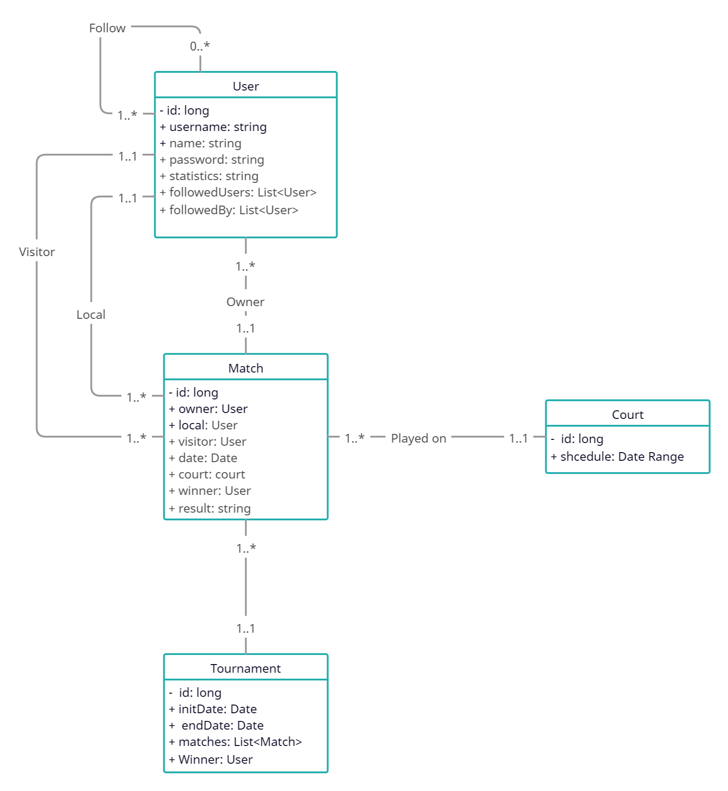

# Club de Tenis
## Integrantes
* RUBÉN BARGUEÑO PRIETO
  * E-mail:
  * GitHub:
* ARIEL CARNÉS BLASCO
  * E-mail:
  * GitHub:
* HUGO FERNANDEZ SISQUELLA
  * E-mail: h.fernandez.2024@alumnos.urjc.es
  * GitHub: @huugoox
* RODRIGO LÓPEZ BARCA 
  * E-mail: r.lopezb.2019@alumnos.urjc.es
  * GitHub: @rodriLB
## Estrucutra de entidades

## Permisos de los usuarios
* Visitante
  * Ver los partidos y torneos jugados por cualquier usuario
  * Ver los perfiles de otros usuarios
* Usuario registrado
  * Ver los partidos y torneos jugados por cualquier usuario
  * Ver los perfiles de otros usuarios
  * Seguir a otros usuarios
  * Crear y modificar los partidos propios
  * Reservar una pista
  * Invitar otros usuarios a un partido
* Administrador
  * Ver los partidos y torneos jugados por cualquier usuario
  * Crear y modificar torneos
  * Crear y modificar partidos de cualquier usuario
  * Crear y modificar pistas
  * Modificar usuarios

