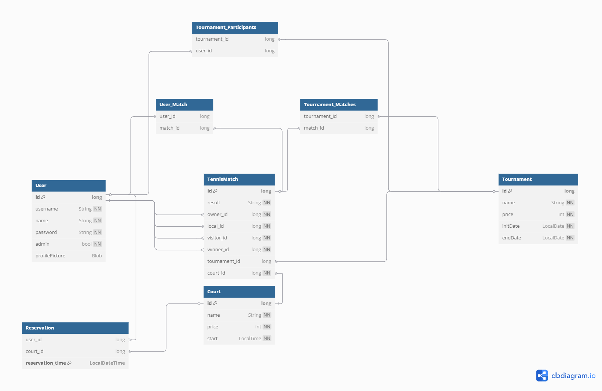

# Club de Tenis
## Permisos de los usuarios
* Visitante
  * Ver los partidos y torneos jugados por cualquier usuario
  * Ver los perfiles de otros usuarios
  * Ver los torenos
* Usuario registrado
  * Ver los partidos y torneos jugados por cualquier usuario
  * Ver los perfiles de otros usuarios
  * Crear y modificar los partidos propios
  * Reservar una pista
* Administrador
  * Ver los partidos y torneos jugados por cualquier usuario
  * Crear y modificar torneos
  * Crear y modificar partidos de cualquier usuario
  * Crear y modificar pistas
  * Modificar usuarios

## Capturas de pantalla

*Página principal:
 

Podemos ver la barra de navegación la cual estará presente en el resto de páginas. En esta tenemos los siguientes textos que nos redirigen a las páginas relacionadas con cada uno y dos botones, “Entrar” el cual nos lleva a la página de login y “Registrarse” que nos lleva a la pagina de registro.
Debajo de esta se encuentra la sección de “Últimos Partidos” y “Lista de Torneos” en las que se ven los partidos jugados y los torneos respectivamente.

*Página de registro:
 

Esta página sirve para que los usuarios se registren, es requerido que el usuario introduzca todos los campos a excepción de “Foto de Perfil” ya que este es opcional.

*Pagina de Inicio de sesión/Login
 

En esta página tenemos los campos para rellenar “Username” y “Contraseña” y el botón Enviar para hacer el login.

*Pagina de Perfil de usuario:
 

En la barra de navegación al iniciar sesión se cambiarán los botones por “@username” y “Salir” los cuales te llevarán a la página del perfil del usuario y el se salir te cerrarán la sesión y te llevara a la página de login.
Además, en esta se encuentra la foto del usuario, a su derecha su username, debajo de estos el botón de modificar, que solo se mostrará si nuestra sesión es la del perfil o un administrador y por último el nombre y los partidos que este ha jugado.

*Página de Partidos:
 

En esta pagina se nos muestran los partidos jugados y el botón “Nuevo Partido” para crear un nuevo partido el cual solo veremos si hemos iniciado sesión.
 
*Página de Detalles del Partido:
 

En esta página está el usuario local y visitante, el resultado y el ganador de este junto con los botones de “Modificar” y “Eliminar” los cuales solo se verán si eres el propietario del partido o un administrador.

*Página de Modificar Partido/Crear Partido:
 

La página de modificación contiene los campos necesarios para crear el partido.
Esta página es casi idéntica a la de creación, las diferencias son que en los campos a rellenar estarían vacíos excepto el de Pista.

*Página de Torneos:
 

En esta página se nos muestran todos los torneos con su nombre, fechas, precio, teléfono para inscribirse(el del club de tenis), y el botón de ver detalles. El resto de botones(Nuevo Torneo, Modificar y Eliminar) solo se verán si somos un administrador.

*Pagina de Detalles del Torneo:
 

En esta pagina se observa el nombre del torneo, las fechas, el precio, los participantes y los partidos jugados del torneo. Si somos el administrador veremos también el botón de “Añadir Partido”.
 
*Página de Creación/Modificación de Torneo:
 

En esta página tenemos el formulario para la creación o modificación de los torneos con los campos necesarios para crear este.

*Página de Pistas:
 

En esta página veremos el nombre, horario, precio y el botón de reservar de estas si somos un usuario normal o un invitado y veremos de manera adicional los botones de crear pista, modificar y eliminar en caso de que seamos administrador.
 
*Página de Reservar pista:
 

En esta pagina vemos el nombre de la pista, su precio, y dos campos para la fecha y la hora de la reserva.

*Página de Creación/Modificación de Pista:
 

En esta página tenemos los campos necesarios para crear o modificar una pista cambiará de “Crear Pista” a “Modificar Pista” en caso de estar modificando una pista.
 
*Página de Lista de Usuarios:
 

Está pagina será solo visible para los administradores y es accesible desde la barra de navegación desde el texto “Usuarios”, en esta el administrador puede ver los perfiles de los usuarios y eliminarlos si fuese necesario.

*Página de Error:
 

Esta página será la que veremos cuando vayamos a una página inexistente u otros errores ocasionados en alguno de estos se cambiará el texto para indicar el error. Ej. Al intentar acceder a “/tournament/new” sin ser administrador nos dará el texto “Un usuario sin privilegios no puede crear un torneo”.
## Diagrama de navegación
## Diagrama de entidades

## Diagrama de Clases
## Instrucciones de Ejecución
1. Tener instalado Docker 
2. Tener instalado Maven
3. Ejecutar el siguiente comando para iniciar la base de datos o el script `runMySQL.ps1`
```shell
docker run --rm -e MYSQL_ROOT_PASSWORD=admin  -e MYSQL_DATABASE=clubtenis -p 3306:3306 -d mysql:8.0.22
```
4. Ejecutar el siguiente comando para iniciar el servidor spring
```shell
mvn spring-boot:run
```
5. Accede a la aplicación a traves de: http://localhost:8080
## Integrantes
* RUBÉN BARGUEÑO PRIETO
  * E-mail: r.bargueno.2020@alumnos.urjc.es
  * GitHub: @RuBaPr
* ARIEL CARNÉS BLASCO
  * E-mail: a.carnes.2021@alumnos.urjc.es
  * GitHub: @ArielCB
* HUGO FERNANDEZ SISQUELLA
  * E-mail: h.fernandez.2024@alumnos.urjc.es
  * GitHub: @huugoox
* RODRIGO LÓPEZ BARCA 
  * E-mail: r.lopezb.2019@alumnos.urjc.es
  * GitHub: @rodriLB

## Participación:
* RUBÉN BARGUEÑO PRIETO
  * Tareas:
  * Commits más Significativos:
  * Ficheros en los que participa: 
* ARIEL CARNÉS BLASCO
  * Tareas:
  * Commits más Significativos:
  * Ficheros en los que participa:
* HUGO FERNANDEZ SISQUELLA
  * Tareas:
  * Commits más Significativos:
  * Ficheros en los que participa:
* RODRIGO LÓPEZ BARCA
  * Tareas: He participado en la creación de los endpoints, las relaciones de las entidades en la base de datos, y la gestión de estas.
  * Commits más Significativos:
    * [Added court creation/modification functionality](https://github.com/SSDD-2025/practica-sistemas-distribuidos-2025-grupo-9/commit/2665b5e5ba61b42cf5146bbf534091f272045fa9)
    * [Added court reservation functionality](https://github.com/SSDD-2025/practica-sistemas-distribuidos-2025-grupo-9/commit/c30e54a28c1887fd6cde866de9a4f6e12819b11a)
    * [Added profile picture functionality](https://github.com/SSDD-2025/practica-sistemas-distribuidos-2025-grupo-9/commit/86f7797abbe0f2274e481dfa3d0dd5461712c598)
    * [Added modify functionality to tournament entity](https://github.com/SSDD-2025/practica-sistemas-distribuidos-2025-grupo-9/commit/eb7437a9ae5cf9c0ee713ed4203bcabe7e220234)
    * [Created modify endpoint for user](https://github.com/SSDD-2025/practica-sistemas-distribuidos-2025-grupo-9/commit/64c0e7354cf7f25bed6961a7a42b9ca2ea55d092)
  * Ficheros en los que participa: 
    * [DatabasePopulator.java](src%2Fmain%2Fjava%2Fes%2Furjc%2Fclub_tenis%2Fservice%2FDatabasePopulator.java)
    * [MatchController.java](src%2Fmain%2Fjava%2Fes%2Furjc%2Fclub_tenis%2Fcontroller%2FMatchController.java)
    * [TennisMatch.java](src%2Fmain%2Fjava%2Fes%2Furjc%2Fclub_tenis%2Fmodel%2FTennisMatch.java)
    * [MatchService.java](src%2Fmain%2Fjava%2Fes%2Furjc%2Fclub_tenis%2Fservice%2FMatchService.java)
    * [UserController.java](src%2Fmain%2Fjava%2Fes%2Furjc%2Fclub_tenis%2Fcontroller%2FUserController.java)
